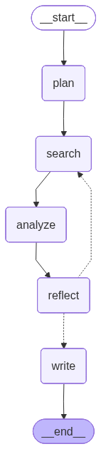

# LangChain Deep Research Agent

A simple deep research agent built with LangGraph. It plans a research strategy, runs iterative web searches, analyzes and reports findings, reflects on coverage, and writes a final cited report.

## Requirements

Before running the project, have these ready:

- an `OPENAI_API_KEY`
- a `TAVILY_API_KEY`

The startup script will prompt you for both keys and generate a `.env` file automatically.

## Start The App

From the repository root, run:

```bash
./scripts/start.sh
```

What this does:

- creates `.venv` if needed
- installs Python dependencies
- prompts for your OpenAI and Tavily API keys if `.env` is missing or incomplete
- starts the local UI at `http://127.0.0.1:8123`

## LangSmith Studio

If you want to inspect the graph in LangSmith Studio / `langgraph dev`, run:

```bash
./scripts/start_langsmith.sh
```

## Graph

Below is the current graph visualization used by the agent:

